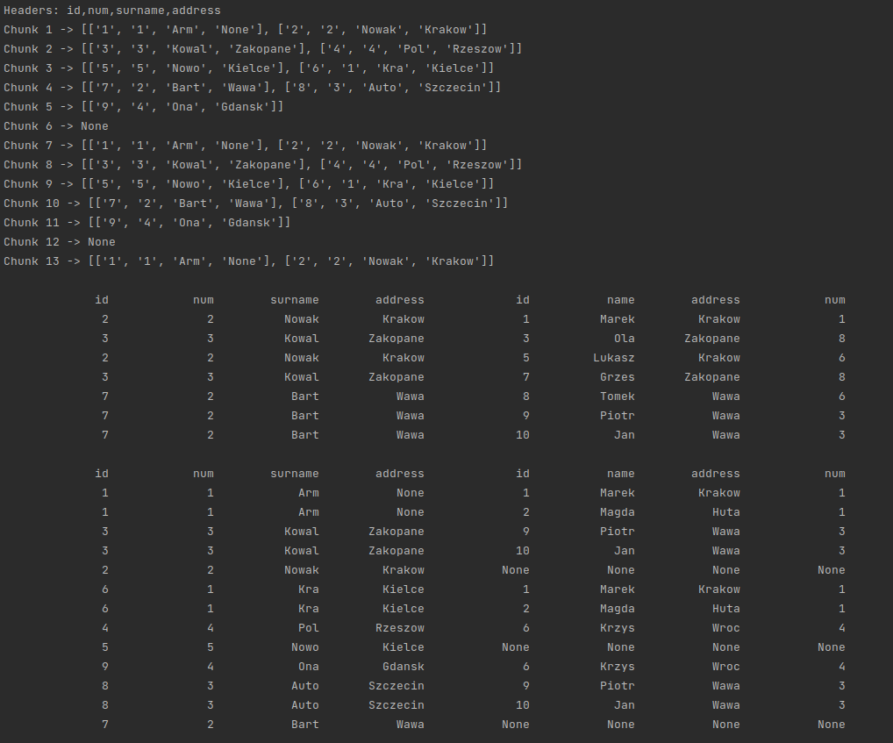

# Recruitment task - VirtusLab

## Task

The task is to implement program, which will read two csv files, 
join them using specified column and then write the result on the standard output.
Program support inner, left and right join.

Input files conform to the [rfc4180](https://datatracker.ietf.org/doc/html/rfc4180) and always have headers. 
File can be much bigger than there is available memory on the machine.

## Execution

Program can be executed on system Linux from root directory with a command:
*./src/join.py file_path file_path column_name [join_type]*, where *join_type* is one of: *inner*, *left* and *right*.
If *join_type* is not specified, program will do inner join. Script [join.py](src/join.py) is in the *src* directory.
It is possible to adjust script for windows by *pyinstaller* library.

## Technologies

Python 3.9

## Description of the solution

I deal with big data by [*CSVReader*](src/reader.py) class. This class read data from file in chunks. 
Size of every chunk is equal (or smaller for last chunk) with parameter CHUNK_SIZE in script [join.py](src/join.py). 
In this way I solved problem with RAM size. The next step is processing every chunk. 
For every chunk in first file I create dictionary. Keys in dict are values from specified column 
and value is list with rows, which correspond to key. After creating dict I'm going through rows in second file 
(in every chunk). If row have value from dict in specified column, 
it will mean that this row and rows from lists in dict create line in join.
For left join I use 'visited' dictionary. Every element which is not fitted I print with Nones for second file. 
Right join is implemented as left join with swap input files.
If we assume constant time for operation in dictionary (there is average time), 
join for one of chunk from first file take linear time. So dictionary is good structure for this task. 
With increasing number of chunks, increases execution time. 
It is very important to match right CHUNK_SIZE. This parameter should be big but memory in machine is the limit.

## Tests

I made tests for two small files and one big. 
I tested generator for reading file in chunks. It behaves in line with expectations.
I simulated inner and left join (right join work in the same way). I checked results by compare with files and results 
are correct. Program does well with big file. I didn't see alarming increase of RAM usage.
I didn't write automatic tests. I print result in standard output in app, so I must capture this for automatic tests. 
It requires using new code and libraries for join. 
This app is not complicated, so I think that check dividing into chunks is most important, and I did this.

Results for tests:
